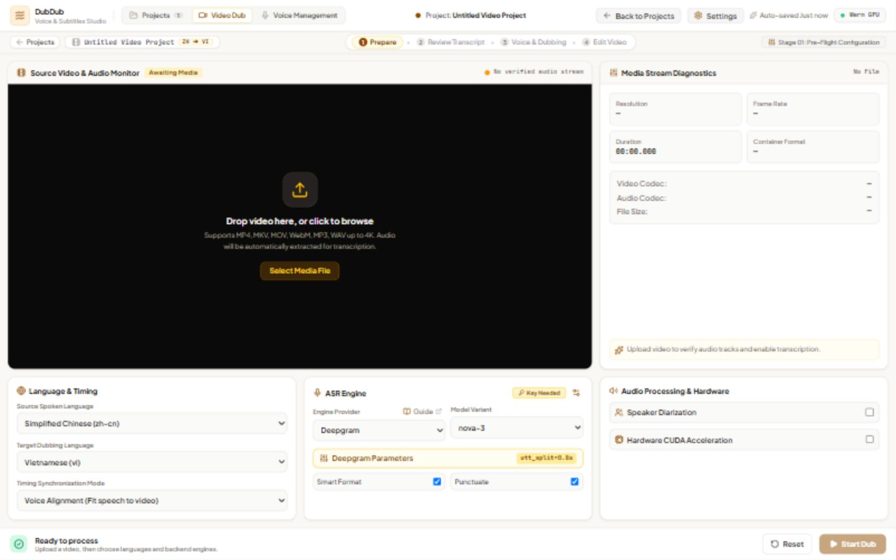
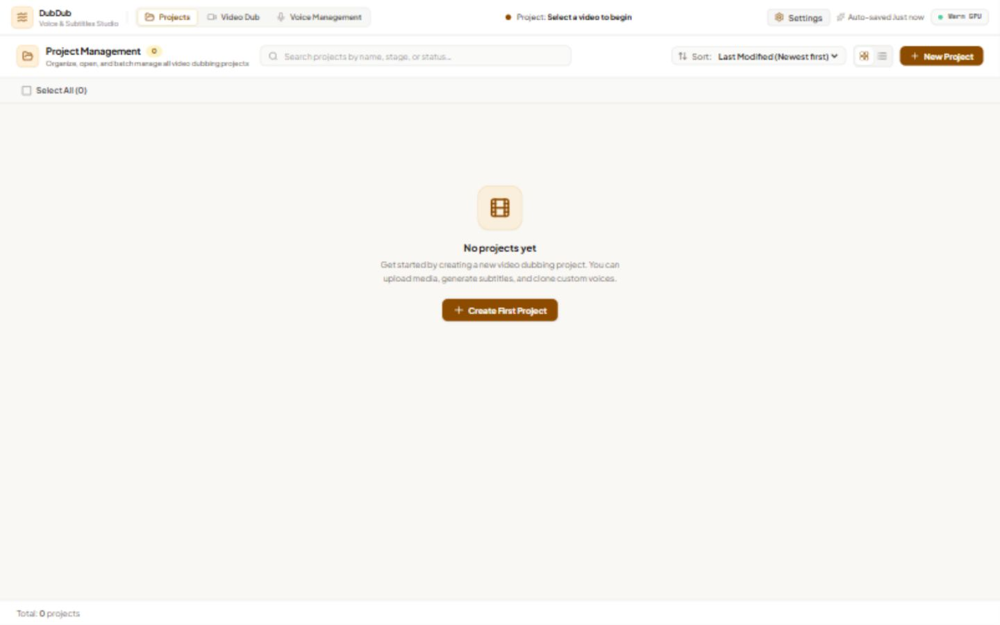
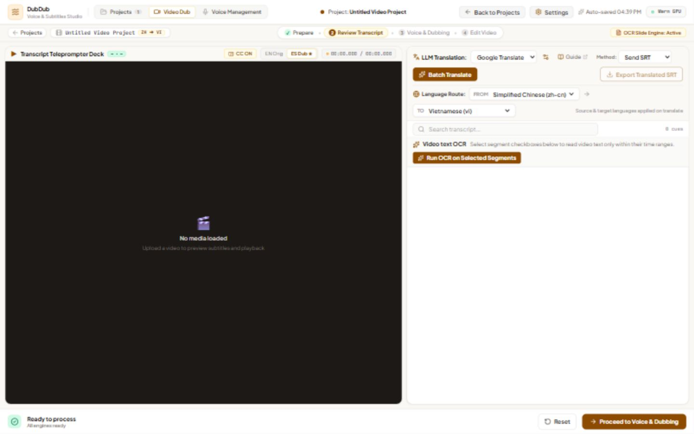
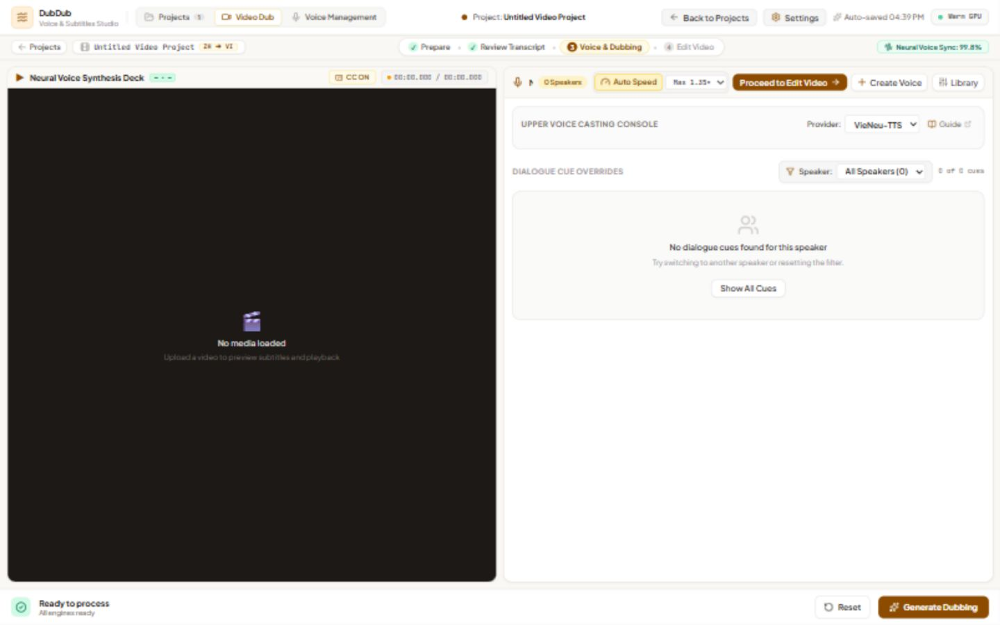
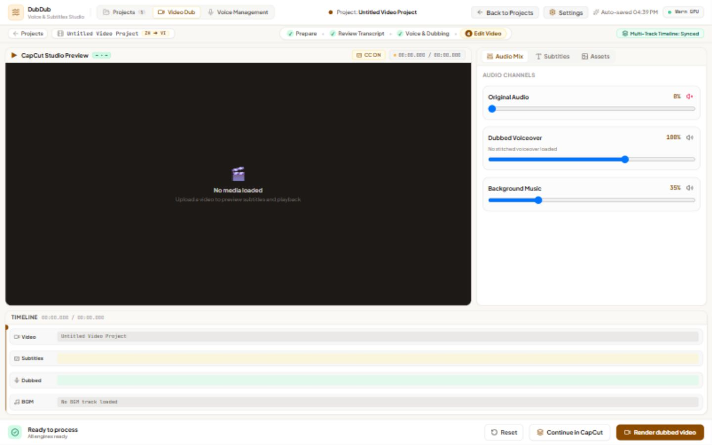
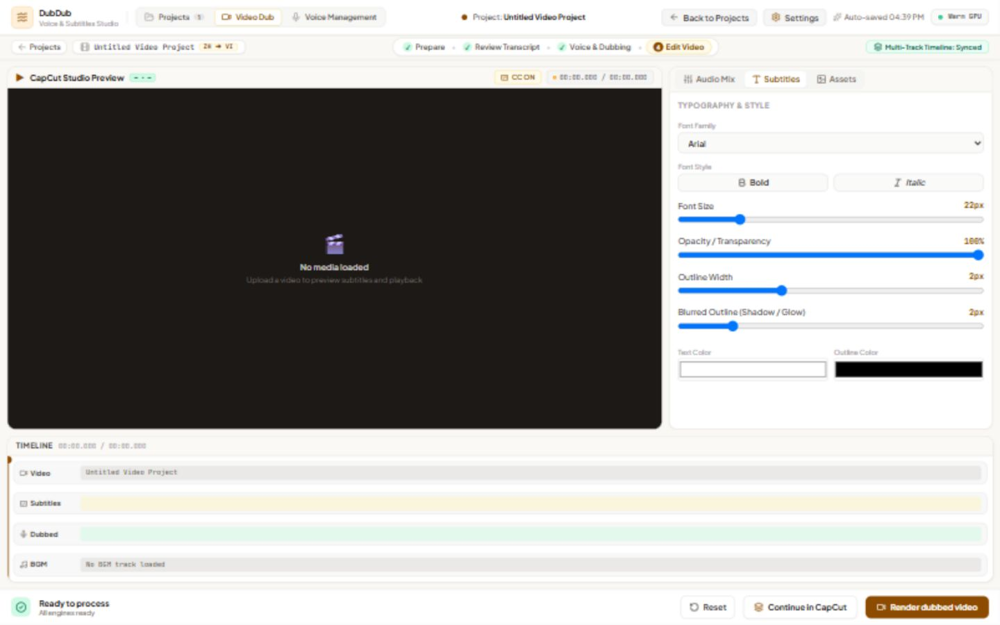
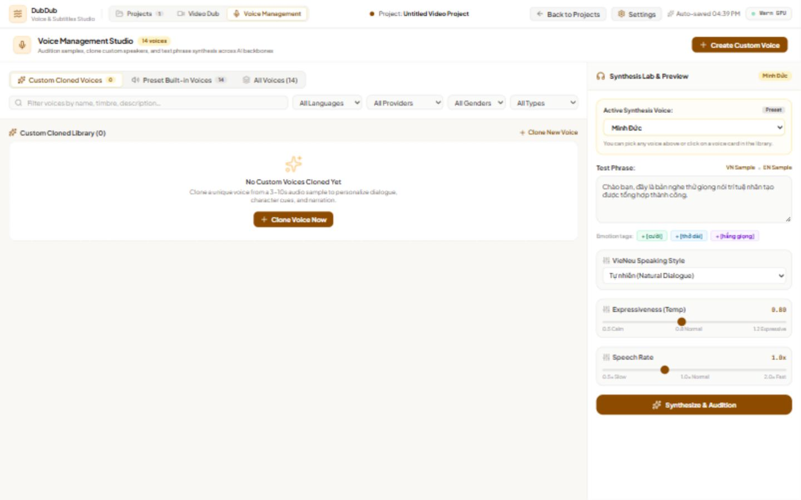

# DubDub (pyVideoTrans)

**A local web studio for transcribing, translating, dubbing, and exporting video.**

DubDub guides a project through four stages: prepare media and recognize speech, review and translate subtitles, generate dubbed voices, then mix audio and export. The browser UI runs on a Python backend and a React frontend. A CLI is also available for headless workflows.



> Screenshots below were captured from the running React app with a new, empty project. They show the interface before media processing; they do not represent completed transcription, synthesis, or rendering output.

## What you can do

| Area | Current workflow |
| --- | --- |
| **Prepare** | Upload video or audio, inspect its streams and duration, choose languages, ASR provider, model, and timing options. |
| **Review transcript** | Edit segments and timing, translate subtitles, export a translated SRT, or use video OCR to replace selected speech-recognition segments. |
| **Voice dubbing** | Assign voices, generate and audition segment previews, and assemble a voiceover at subtitle times. |
| **Edit and export** | Preview the video, adjust original/voiceover/background-music levels, style subtitles, render a dubbed video, or export assets for CapCut. |
| **Projects and voices** | Save project data locally, manage projects, choose preset voices, and create custom voice entries. |

The UI offers ASR choices including Qwen-ASR, Deepgram, Gemini STT, Google STT, ElevenLabs, and Whisper; translation choices include Google Translate, OpenAI, Gemini, and DeepSeek; TTS choices are VieNeu-TTS, OmniVoice, ElevenLabs, and Gemini TTS. Availability depends on the selected provider's credentials, models, network access, and hardware.

### Screenshots

**Projects** — create and reopen local projects.



**Review transcript** — translation and segment OCR controls.



**Voice dubbing** — voice selection and segment preview workspace.



**Edit video** — audio mix and timeline view.



**Subtitle styling** — font, opacity, outline, and color controls.



**Voice management** — preset and custom voice library.



## Install from source

### Requirements

- **Python 3.10** (the project declares `>=3.10, <3.11` in `pyproject.toml`).
- [uv](https://docs.astral.sh/uv/getting-started/installation/) for Python dependencies.
- [Bun](https://bun.sh/get) for the React frontend.
- [FFmpeg and FFprobe](https://ffmpeg.org/download.html) on `PATH` for media processing.
- Git to clone the repository. Local model providers can require substantial download space, memory, and, optionally, a compatible GPU.

PowerShell example (skip the clone step if you already have the repository):

```powershell
git clone https://github.com/datnndd/DubDub.git
Set-Location DubDub
uv sync --frozen
bun install --frozen-lockfile
Push-Location frontend
bun install --frozen-lockfile
Pop-Location
```

Check that media tools are available:

```powershell
ffmpeg -version
ffprobe -version
```

### Run locally

Build the frontend, then start the single-port server:

```powershell
bun run build
uv run --frozen python webui.py
```

Open **http://127.0.0.1:7860**. The API documentation is at **http://127.0.0.1:7860/docs**. Stop the server with `Ctrl+C`. To listen on another address or port:

```powershell
uv run --frozen python webui.py --host 0.0.0.0 --port 8080
```

For frontend development, run `bun run dev` from the repository root after installing dependencies. It starts the backend on port 7860 and Vite on **http://localhost:3000**; Vite proxies `/api` requests to the backend.

## Docker Compose

Docker builds the frontend and Python runtime inside the image. Choose **one** service:

```powershell
# CPU
docker compose up --build -d webui

# NVIDIA GPU (requires a working GPU container runtime)
docker compose --profile gpu up --build -d webui-gpu
```

Open **http://127.0.0.1:7860**. Compose mounts `data/`, `models/`, `output/`, and `logs/` from the host. These images are built from the included `Dockerfile`; this README does not claim that every provider or GPU model has been exercised in a clean container.

## First project

1. Select **New Project**, then upload a video or audio file in **Prepare**.
2. Check the detected media details. Choose source and target languages and configure any provider credentials in **Settings**.
3. Run recognition, review the resulting segments, translate or correct subtitles, and choose voices.
4. Generate voice previews, adjust the final mix and subtitle appearance, then render or export the CapCut assets.

Provider-specific API keys and local model files are needed only for the providers you select. Jobs and uploaded-media identifiers are process-local; an active job does **not** resume automatically after a server restart. Project records and generated outputs are stored locally. Some visible editing controls, including freeform timeline editing, lip sync, inpainting, face retouching, and 4K enhancement, are not connected to processing yet. See [WebUI behavior and limits](docs/webui.md).

## Troubleshooting and documentation

- **Frontend build missing:** run `bun run build`, then restart the server.
- **Media inspection fails:** verify both `ffmpeg` and `ffprobe` are available and the file can be opened.
- **Provider fails to start:** check its settings, required credential or model, and the server log. Model downloads can make the first run slower.
- **CLI:** `uv run --frozen cli.py --help`; see the [CLI guide](docs/cli.md).
- More detail: [FAQ](docs/faq.md) · [architecture](docs/architecture.md) · [WebUI guide](docs/webui.md).
