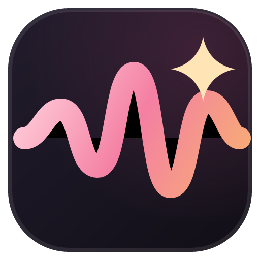

  
  <h1>Sponsor VoiceStudio</h1>
  
<b>Support open-source, local-first voice AI development.</b>

---

## Why sponsor?

VoiceStudio is **free**, **fully local**, and **AGPL-3.0**. There is no paid tier, no accounts, and no cloud subscription. Sponsorship helps support continued maintenance, testing hardware, and future enhancements.

---

## How to support

If you would like to sponsor or support this project:

- **Email:** `[your-email@example.com]`
- **Donation / Sponsorship Link:** `[your-link-here]`

---

## Not a paywall

Sponsorship is a **thank-you, never a paywall.**

Every feature of VoiceStudio is and will remain **free** and **open-source under [AGPL-3.0](LICENSE)**. Sponsors do **not** get private builds, gated features, or license exceptions.
